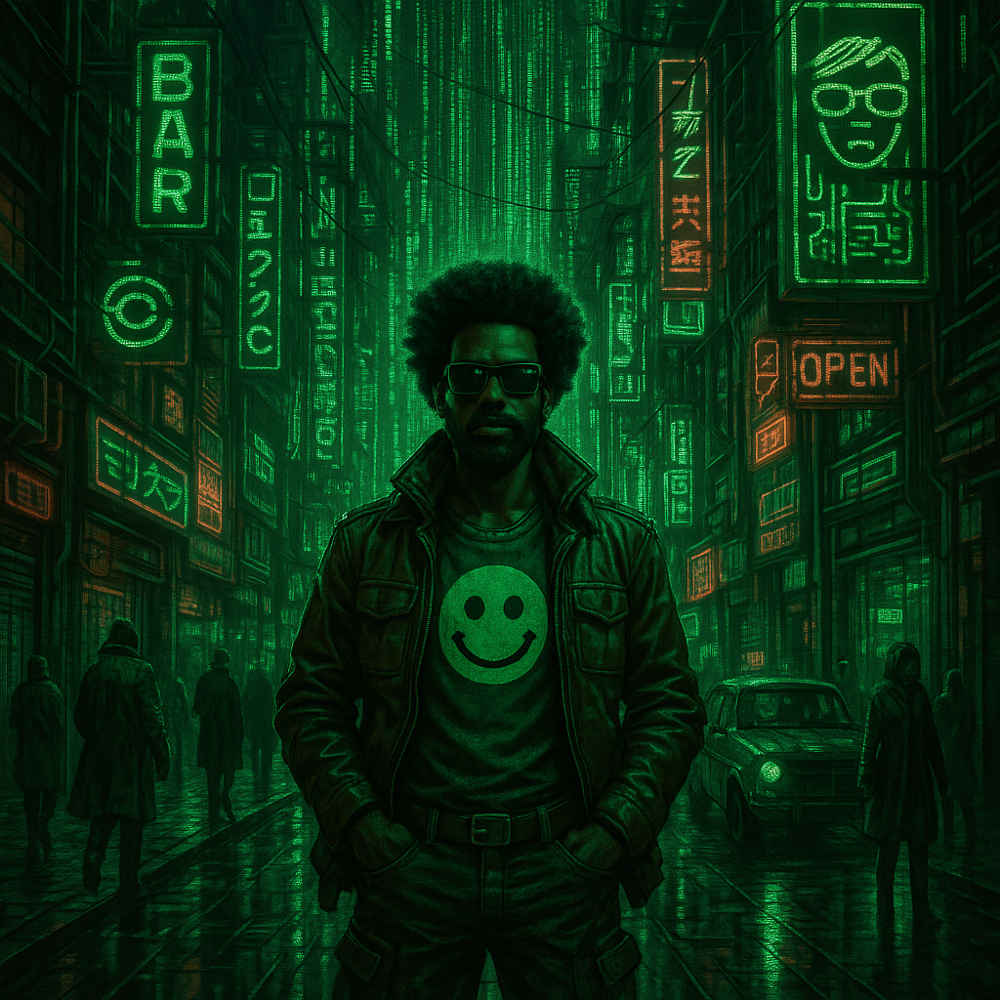

GoodQ02
“If you can’t own your tools, you don’t own your future.”

Welcome to GoodQ02—where the boundary between automation, creativity, and autonomy gets redrawn.
We’re not here to build another cloud-shaped cage. We’re here to take the best of modern tech—AI, multimodal pipelines, local-first infrastructure—and put it firmly in your hands.

Mission
Build systems that empower, not entrap.
Engineer pipelines, platforms, and playful experiments that are:

Locally owned

Transparent

Performance-obsessed

Human-centered

Resistant to the “it’s just how things are” mindset

Ethos
Your data, your rules.

Automate to liberate—not to surveil.

If it’s not fun or useful, why bother?

No gatekeeping. Knowledge is for sharing.

Rigorous enough for MI6, friendly enough for your grandma’s AOL inbox.

Hack it, remix it, make it yours.

Mistakes are the cost of discovery. Ship anyway.

What We Build
AI-accelerated pipelines for creative and personal memory

Automation that organizes chaos (not the other way around)

Tools for musicians, makers, nurses, coders, and the rest of the beautiful weirdos

Frameworks that let you say: “I own this. I get this.”

How We Work
Push often.

Document well (but not too well).

Prefer clever over complicated.

Be excellent to each other.

Open door. Open mind.

Feedback isn’t just welcome—it’s standard operating procedure.

Who’s Welcome
If you’re here, you belong.
If you want to help, you’re in.
If you’ve ever automated a pizza order or mapped out your HDMI cables on a napkin, you’ll fit right in.

Links
🌐 askgoodq.com

📷 Instagram @goodq02

🚌 The GoodBus

Join us. Build with us. Break things with us. The future should belong to the curious.
